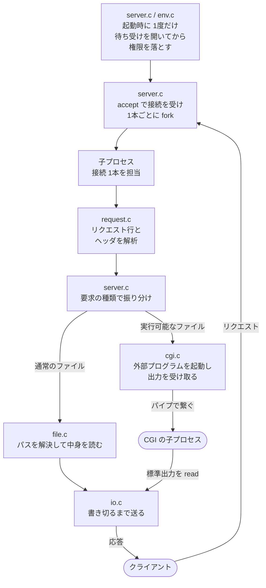
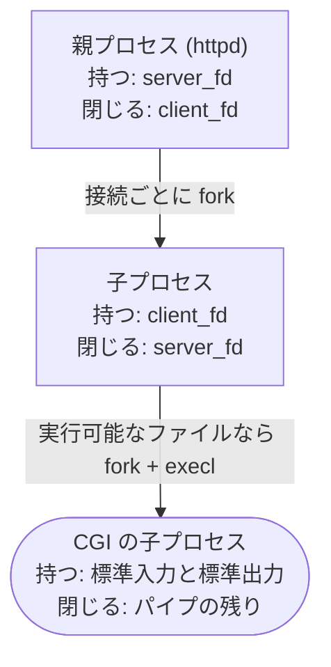
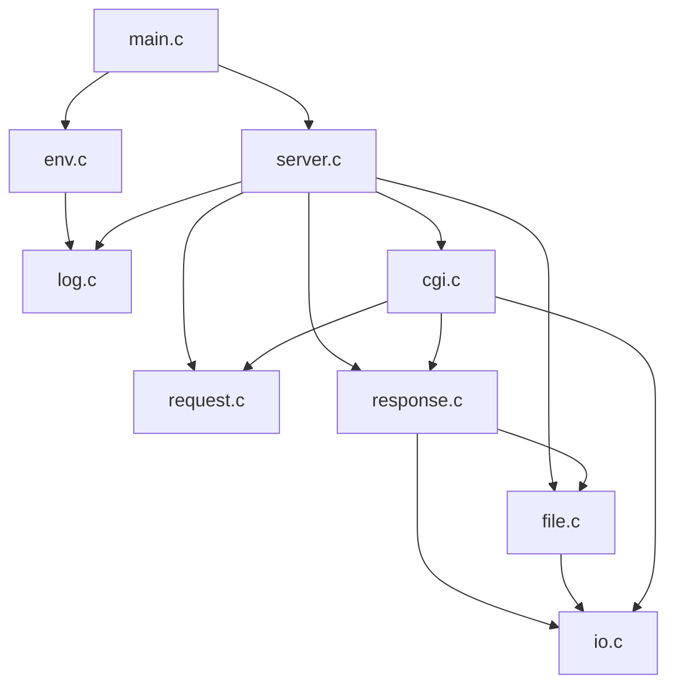
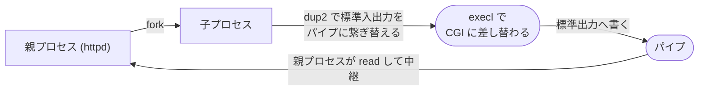

# httpd

`docroot` 以下の静的ファイルを配信します。
実行可能なファイルが置いてあれば、それを CGI として起動します。
接続を受けるたびに `fork` し、子プロセスが 1本の接続を最後まで担当します。

---

## 使用方法

```sh
httpd/httpd --port=8080 --debug httpd/docroot
```

既定のポートは 80 です。
特権が無いときは `--port` で変えます。

```sh
$ curl -si http://localhost:8080/
HTTP/1.0 200 OK
Server: httpd/0.1
Connection: close
Content-Length: 58
Content-Type: text/html

<!doctype html>
<title>httpd</title>
<p>Hello from httpd!
```

`docroot` に置いた `dump.cgi` を叩くと、こうなります。

```sh
$ curl -s 'http://localhost:8080/dump.cgi?a=1'
method=GET
query=a=1
body=0
```

ボディを渡していないので、CGI から見ると標準入力はすぐ終端になります。

### 起動オプション

| | |
| :--- | :--- |
| `--port=n` | 待ち受けるポート。既定は 80 |
| `--debug` | デーモン化せず、記録も端末へ出す |
| `--chroot --user=u --group=g` | docroot に隔離して権限を落とす。3つそろって指定する |

---

## 全体像

接続が入ってから応答が出るまでの流れです。



子プロセスの中では、担当している 1本の接続のことだけ考えれば済みます。
`read` で待たされても、止まるのはその子プロセスだけです。
他の接続には影響しません。
どこまで読んだかは、関数のローカル変数とスタックが覚えていてくれます。

ただし、同時接続の数だけプロセスが必要になります。
接続が増えると、処理そのものより先にプロセスの生成コストとメモリが問題になります (C10K 問題)。
このサーバーは、そこまでの規模を想定していません。

## プロセスの親子関係と fd

CGI を起動するときは、もう 1度 `fork` します。
どのプロセスがどの fd を持つかは決まっています。
ただし閉じ忘れたときの症状は、fd ごとに違います。



| 閉じ忘れたもの | 何が起きるか |
| :--- | :--- |
| 親プロセスの `client_fd` | 接続ごとに fd が漏れる。応答するのは子プロセスなので、親プロセスには要らない |
| 子プロセスの `server_fd` | 親プロセスを止めてもポートが解放されない。待ち受けソケットを子プロセスが持ったままになるため |
| 親プロセスのパイプ (書き込み側) | CGI の標準入力に終端が届かない。書き込み側が 1つでも開いていると、`read` が 0 を返さない |

---

## 読む順序

矢印は呼ぶ側から呼ばれる側へ向いています。
Makefile に書いてある依存関係と同じです。



上へ戻る線が 1本もないので、上から順に読めば読み返さずに済みます。

| ファイル | 役割 | 主に呼ぶ POSIX の関数 |
| :--- | :--- | :--- |
| `main.c` | 引数を見て組み立てる | `realpath` |
| `server.c` | 待ち受け、`accept`、接続ごとの `fork` | `socket` `bind` `listen` `accept` `fork` `alarm` |
| `env.c` | シグナル・chroot・デーモン化 | `chroot` `setgid` `initgroups` `setuid` `setsid` `sigaction` |
| `log.c` | syslog への記録 | `openlog` |
| `request.c` | リクエストの読み取りと解析 | `read` |
| `response.c` | 応答の組み立て | — |
| `file.c` | パスの解決とファイルの送出 | `open` `fstat` `read` |
| `cgi.c` | 外部プログラムの起動 | `pipe` `fork` `dup2` `execl` |
| `io.c` | 書き切るまで送る | `write` |

---

## CGI

シェルがパイプラインを繋ぐときと同じ 4つのシステムコールを使います。



`fork` した直後、パイプの両端は親プロセスにも子プロセスにも複製されています。
書き込み側を持っているプロセスが 1つでも残っていると、読み取り側の `read` は 0 を返しません。
終端が届かないと、CGI は入力を待ったまま止まります。
だから親プロセスは、自分が使わない側をすぐ閉じます。

```c
close(to_cgi[0]);
close(to_cgi[1]);   /* ボディは渡さないので、すぐ閉じて終端を届ける */
close(from_cgi[1]);
```

---

## テスト

```sh
$ make test
```

`httpd/tests/http.py` が httpd を起動し、ソケットへ直接リクエストを流します。
`curl` では送れないものを送りたいからです。

```
小文字の get / リクエスト行の欠落 / 200行のヘッダ / %00 を混ぜたパス
```

`mylibc` 側のテストの方針は [mylibc.md](mylibc.md) にあります。

---

## 参考文献と変更点

ふつうのLinuxプログラミング 第2版 (青木峰郎) を参考にして、機能ごとにファイルを分割したり、途中で見つけた問題を修正したりしながら実装しました。

書き直していく途中で、本のコードに問題が 3つ見つかりました。

| | 本 | このサーバー |
| :--- | :--- | :--- |
| パスの検査 | `sprintf` で繋ぐだけで、`..` を検査していない | 経路の要素が `..` なら弾く |
| `Content-Type` | `return "text/plain";` の簡易実装 | 拡張子から引く。分からなければ `application/octet-stream` |
| ファイルの開き直し | `lstat` で調べ、送るときに `open` で開き直している | `open` してから `fstat`。調べた実体と送る実体が同じ |

3つ目は実際に踏みました。
`lstat` で調べた後に権限が変わると、もう読めないファイルなのに `Content-Length` を宣言してしまいます。
そのあとの `open` は失敗しますが、ヘッダはすでに送った後です。
引き返せないので、本文 0バイトのまま接続を閉じることになっていました。

そのほかの変更点:

- 解析をバッファ渡しに変更 (本は `FILE*` から空行まで待つ形)
- 壊れたリクエストは終了せず 400 で応答 (本は 6箇所で `log_exit`)
- グローバル変数を設定用の構造体に集約
- `chroot` と権限降格の順序を入れ替え (本の順序だと `--chroot --port=80` が Linux で起動しない)

本に無いものは CGI、mylibc、テスト一式です。

---

## 既知の制限

| | |
| :--- | :--- |
| HTTP のバージョン | 1.0 相当。keep-alive、条件付き GET、`Range` は実装していない |
| リクエストのボディ | 読まない。静的ファイルへの POST には 405 を返し、CGI にも渡さない |
| `Date` ヘッダ | 出していない。本は出している |
| IPv4 と IPv6 | 待ち受けは IPv6 の 1本だけ。IPv4 も受けられるかは `IPV6_V6ONLY` の既定値しだい |
| TLS | 範囲外。暗号は目的に入っていない |
| 同時接続 | 接続ごとに `fork` するので、増えるとプロセス数で頭打ちになる |
